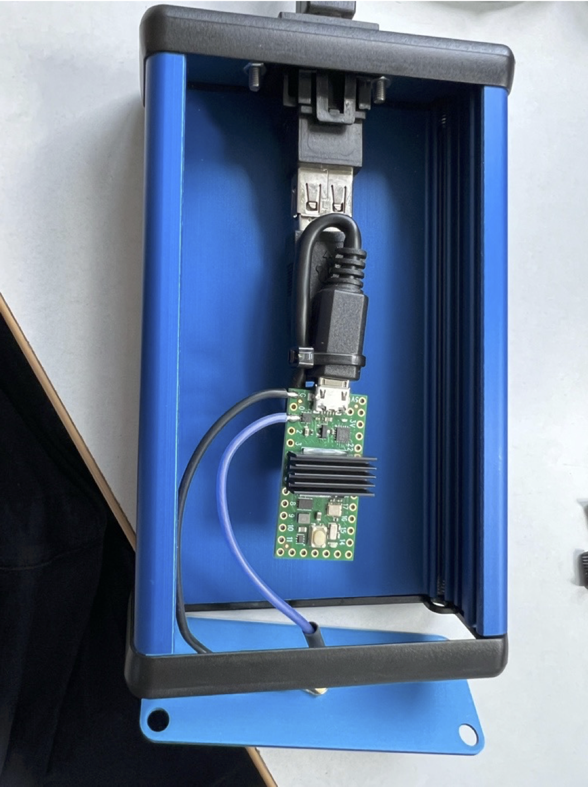
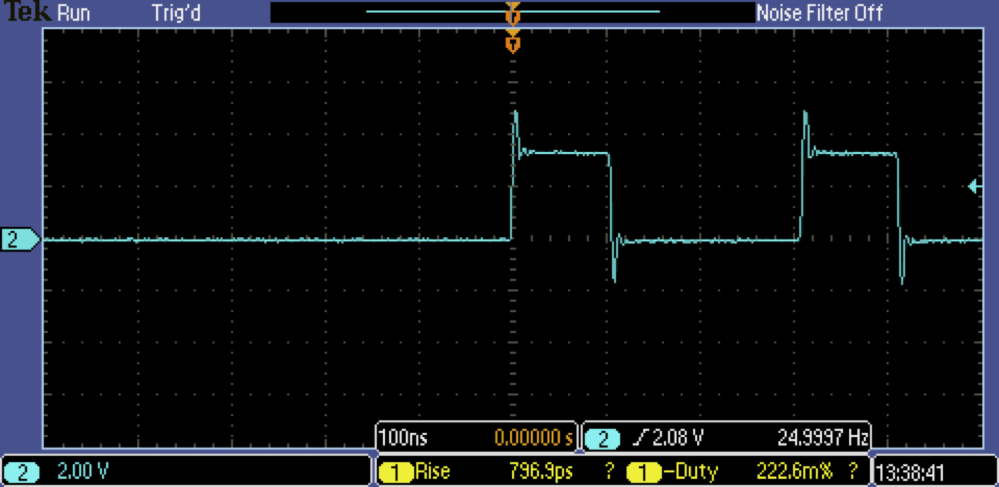

---
title: Teensy Double-Pulse Generator
linktitle: Teensy Pulse Generator

toc: true
type: docs
weight: 100
--- 

How to use the Teensy Double-Pulse Generator

<!--more-->



## Introduction

The Teensy double-pulse generator is used to pairs of pulses of
duration and separation of 10s of ns, configurable via software.  It
is implemented using a [Teensy 4.0
Microcontoller](https://www.pjrc.com/store/teensy40.html) programmed
in Arduino/C and is communicated with via serial over USB. This page
contains some details on how to use the generator.

<center>

</center>

## Firmware


The source code for the Teensy is [available on github](https://github.com/UCD-Physics/Teensy-Pulse-Generator/).


## Connections

The device is connected to a PC via a USB and has a USB Type B connector.

The output is via [SMB](https://en.wikipedia.org/wiki/SMB_connector)
and an
SMB-to-[LEMO](https://www.lemo.com/int_en/solutions/specialties/00-nim-camac.html)
cable is provided.


## Pulse capability

The device can generate positive TTL pulses of
duration and spacing of 20ns or more, and with repitition rates of
hundreds of Hz. If using with a [NIM fast negative-logic](https://en.wikipedia.org/wiki/Nuclear_Instrumentation_Module) system then
you must use a TTL-to-NIM converter module.

For example, the output for:
 * pulseInterval: 100 (ms)
 * interPulseDelay: 200 (ns)
 * pulseWidth: 100 (ns)
 
is shown in the image below:

<center>

</center>


## Serial Communication

The device is controlled over a USB serial line from a PC that can be
communicated with using a terminal program (such as
[Termite](http://www.compuphase.com/software_termite.htm)), or using
PySerial in Python

### Boot-up message
On boot-up the pulse generator sends the following strings over the serial line:
```
"**************Teensy 4.0 Signal Generator**************");
"> Usage: Send JSON string, for e.g {\"pulseInterval\": 100, \"interPulseDelay\"
"pulseWidth\": 100}."
"> Interval (time between pulse pairs) is in milliseconds."
"> interPulseDelay: Time between the end of the first pulse and the start of the second pulse, in nanoseconds."
"> pulseWidth: Duration of each pulse, in nanoseconds."
"> Robin O'Reilly 2024"
```

Depending on how quickly your serial communications are started with
the device, this string may or may not be received.
{}
If you are going
to be reading the device's responses to your commands (you should!) then
it is suggested that you should read available lines when you start
your program (with a timeout set) to clear the startup message, if present.
{}


## Setting the pulse parameters

To set a given pulse ouput send a json string such as:
```
{"pulseInterval": 100, "interPulseDelay": 200, "pulseWidth": 100}
```
where
 * `pulseInterval` is in ms
 * `interPulseDelay` is in ns
 * `pulseWidth` is in ns


The device responds with an acknowledgement or an error, e.g.

```>OK Parsed values - pulseInterval: 100, interPulseDelay: 200, pulseWidth: 200```

or, in the case of an error:

```>ERR ...```

where `...` gives information about the error.

{} Please note that the interPulseDelay is the time
between the falling edge of the first pulse and the rising edge of
the second pulse. If you want leading-edge to leading-edge times you
must take account of this.  {}


## Which com port?


To use in termite or Python we must first find out what COM port it is
on. Do this by looking for *FT232R USB UART* in Windows (7) *Devices
and Printers*, double click on it and select *Hardware* and we see the
COM port (COM3 when I tested this one). If you are having problems I
recommend this as a fallback to see what the device is doing.

Alternatively: use pyserial (see [Python](#Python) section below):

PySerial has a useful command which lists active com ports (from Python):

```python
from serial.tools import list_ports
for p in list_ports.comports():
    print(p)
```
which will produce output like:
```
COM1 - Communications Port (COM1)
COM3 - USB Serial Device (COM3)
```

## Com port configuration

A baudrate of 115200 is needed, all other options can be left as defaults.


## Python programming 


You can communicate with the device from a PC running Python using PySerial.


To communicate with a serial device in Python we will use [PySerial](https://pythonhosted.org/pyserial/). **PySerial should be installed on all lab computers!** However, if not installed, on Anaconda Python install with with 

    conda install pyserial

or

    pip install pyserial


### Connecting to the Teensy Generator

The code below shows how to import pyserial and set up a
connection. It is essential to set the timeout as well as otherwise if
you try to read the device and it has no data it will block
indefinitely.


```python
import serial

ser = serial.Serial(
    "com3",
    baudrate = 115200,
    timeout = 1  # seconds
)  
```


Some useful PySerial commands (class functions):

```python
write(bytearray)  # writes '\n'-terminated byte array to the device
readline()        # returns one line
readlines()       # returns multiple lines - needs timeoout to be set to know when to end
flush()           # flushes the buffer, wait until all data is written
flushInput()      # flush input buffer, discarding all its contents
flushOutput()     # clear output buffer, aborting the current output and discarding all that is in the buffer.
close()           # close the connection
```

Note: if the connection is open and you try to open it again an error will occur saying something like:

<code>SerialException: could not open port 'com3': PermissionError(13, 'Access is denied.', None, 5)</code>

Hence, you should close the serial port when finished with it.


### Strings and byte arrays

Arrays of bytes are sent to and read from the device. Thus strings must be converted to bytes and vice-versa. 

Note: **It is essential to end every write to the device with a newline (`'\n'`)**

#### To convert a string to bytes use:

    bytes(string_name,'utf-8') 

where 'utf-8' is a common string encoding.


#### To convert bytes to a string use:

    .decode('utf-8')

on the bytes array. 

Examples below will make clearer.

#### Useful helper function:

  ```python
  def data(mystring):
    return bytes(mystring+'\n','utf-8')
  ```


### Sending JSON strings

Python has a JSON library and can create JSON strings easily from
dicts, best illustrated by example:

  ```python
  import json

  js = json.dumps(dict(pulseWidth=100, interPulseDelay=100, pulseInterval=100))

  ```


### A bare-bones example:
  ``` python
  import serial
  import json

  ser = serial.Serial(
    "com3",
    baudrate=115200,
    timeout=1
  )  

  print(ser.readlines())  # Maybe get device startup string if fast enough!

  def data(mystring):
    return bytes(mystring+'\n','utf-8')

  js = json.dumps(dict(pulseWidth=100, interPulseDelay=100, pulseInterval=100)

  ser.write(data(js))

  ser.readlines()
  ```

