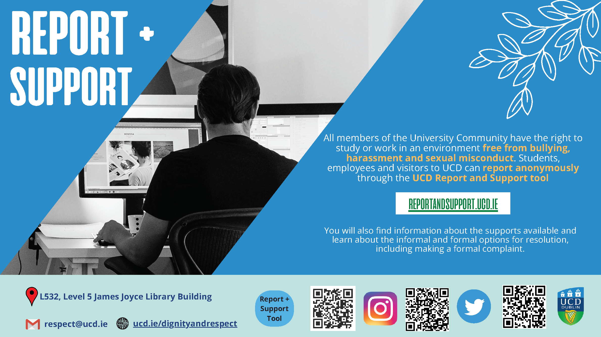
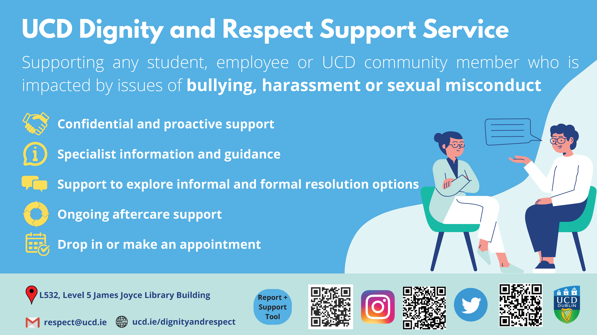

UCD Code of Conduct and Dignity and Respect



## Code of Conduct

The Advanced Laboratories aim to provide an educational environment
with the highest standards of behaviour and ethics, free of bias and
any forms of harrassment or bullying. Students should
familiarise themselves with and abide by the UCD policies on [Student Conduct and Academic Integrity](https://www.ucd.ie/secca/studentconduct/).

## Dignity and Respect Support

